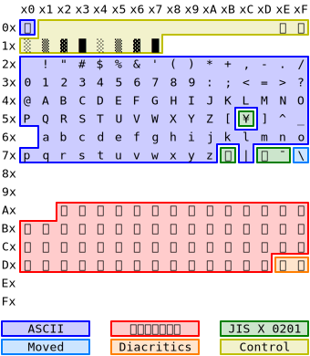

Text
====

:lang: en
:slug: tech/text
:tags: tech

Encoding
--------

GBKiss stores text in one of two encodings:

*  A “`plain text`_” encoding, with 1 byte for every glyph
*  A “`rich text`_” encoding, with multi-byte characters and control codes

Plain Text
~~~~~~~~~~

.. figure:: text/plain.svg
   :alt: Plain text encoding table

   Plain text encoding table

The plain text encoding is mostly a superset of the printable ranges of ASCII_ and `JIS X 0201`_, with a number of changes to fit all glyphs into single bytes:

.. _ASCII: https://en.wikipedia.org/wiki/ASCII
.. _JIS X 0201: https://en.wikipedia.org/wiki/JIS_X_0201

*  ASCII’s curly braces (``{}``) are omitted.
*  JIS X 0201’s separate punctuation (``、。・``) is omitted.
*  Hiragana is encoded separately from katakana.
*  Precomposed kana + diacritics (dakuten/handakuten) are encoded as single bytes.

In order to keep the hiragana and katakana blocks contiguous, the lowercase ASCII block is relocated to the first 32 values, where control characters would normally reside.

For example, the sentence 「これは　テストです。」 (10 glyphs) would be encoded as the following 10-byte string::

   $6A ; こ
   $8A ; れ
   $7A ; は
   $20 ; (space)
   $C3 ; テ
   $BD ; ス
   $C4 ; ト
   $9B ; で
   $6D ; す
   $2E ; .

Rich Text
~~~~~~~~~

   Rich text encoding table

The rich text encoding supports the same printable character set as the plain text encoding, mostly in the same locations as `JIS X 0201`_, but makes the following changes to make room for control characters:

*  Hiragana and Katakana are encoded together, and a control character (``$0E``/``$0F``) switches between sets.
*  Diacritics (dakuten/handakuten) are separate bytes which modify the preceding kana.

For example, the sentence 「これは　テストです。」 (10 glyphs) would be encoded as the following 15-byte string::

   $0F ; (hiragana)
   $BA ; コ
   $DA ; レ
   $CA ; ハ
   $20 ; (space)
   $0E ; (katakana)
   $C3 ; テ
   $BD ; ス
   $C4 ; ト
   $0F ; (hiragana)
   $C3 ; テ
   $DE ; ゛
   $BD ; ス
   $2E ; .
   $0E ; (katakana)

Note the 4 extra control character bytes used to switch between katakana and hiragana, and how the で uses the same ``$C3`` byte as テ with an extra byte for the ゛.

Rich text strings can have a maximum expansion of 3×. For example, the 4-glyph string 「ぴピぴピ」 becomes ``0FCBDF 0ECBDF 0FCBDF 0ECBDF``.
